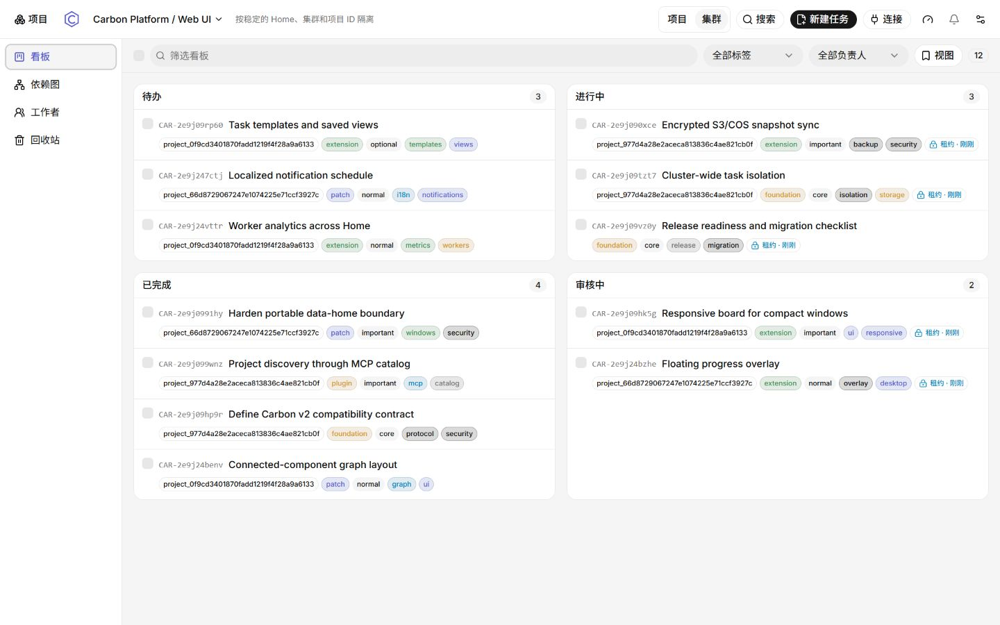

<p align="center">
  
</p>

<h1 align="center">Carbon - 碳原子</h1>

<p align="center">
  <strong>多平台协作下的共享项目任务管理 | 可审计的人与 Coding / Agent 共创</strong>
</p>

<p align="center">
  集成化任务、依赖、会话、检查；在不涉及源码本身(Carbon数据仅涉及自身)下进行任务派发/认领与审计。<br>
  <b>是一个适合 Claude Code + Codex + 其他Agent工具同时对某个项目进行开发的任务管理平台</b>。
</p>

<p align="center">
  
  
  
  
  
  
  <a href="LICENSE"></a>
</p>

<p align="center">
  <a href="https://github.com/chunkburst/Carbon/releases"><strong>📦 下载</strong></a>
  · <a href="docs/quickstart.md">🚀 快速开始</a>
  · <a href="docs/index.md">📚 文档</a>
  · <a href="docs/agents/index.md">🤖 连接 Agent</a>
  · <a href="SECURITY.md">🛡️ 安全</a>
</p>



<p align="center">
  <sub>同一个 Home 中查看项目、任务、负责人、重要性与执行状态；Board、Dependency Graph、Task Detail 和 Work Logs 使用同一份数据。</sub>
</p>

## 📦 下载与安装

当前正式版本：**v1.0.3**。桌面版与 CLI 覆盖 **Windows x64、macOS Apple Silicon / Intel、Linux ARM64 / x64**；所有预编译文件统一发布在 [GitHub Releases](https://github.com/chunkburst/Carbon/releases)。

| 平台 | 推荐发行形式 | 文件 | 说明 |
| --- | --- | --- | --- |
| Windows x64 | ⭐ **NSIS 安装版** | `Carbon_1.0.3_x64-setup.exe` | Windows 10/11 日常使用；创建应用入口并注册 `carbon://`。 |
| Windows x64 | **MSI** | `Carbon_1.0.3_x64_en-US.msi` | 企业、脚本化或集中部署。 |
| Windows x64 | **便携 ZIP** | `Carbon-1.0.3-windows-portable.zip` | 免安装；数据默认跟随完整解压目录。 |
| Windows x64 | **CLI ZIP** | `carbon-1.0.3-windows-x64-cli.zip` | 仅 CLI、Web Server 与 MCP Server。 |
| macOS Apple Silicon | ⭐ **DMG** | `Carbon-1.0.3-macos-arm64.dmg` | M1/M2/M3/M4 等 Apple Silicon Mac。 |
| macOS Intel | **DMG** | `Carbon-1.0.3-macos-x64.dmg` | Intel Mac；最低支持 macOS 12 Monterey。 |
| macOS ARM64 / x64 | **CLI tar.gz** | `carbon-1.0.3-macos-{arm64,x64}-cli.tar.gz` | 对应架构的 CLI、Web 与 MCP Server。 |
| Linux x64 / ARM64 | ⭐ **AppImage** | `Carbon-1.0.3-linux-{x64,arm64}.AppImage` | 通用桌面包；下载后先 `chmod +x`。 |
| Debian / Ubuntu x64 / ARM64 | **DEB** | `Carbon-1.0.3-linux-{x64,arm64}.deb` | 使用 `apt` / `dpkg` 安装。 |
| Linux x64 / ARM64 | **CLI tar.gz** | `carbon-1.0.3-linux-{x64,arm64}-cli.tar.gz` | 对应架构的 CLI、Web 与 MCP Server。 |

> 当前 v1.0.3 构建尚未进行商业代码签名。Windows 可能显示 SmartScreen 提示；macOS DMG **未签名、未公证**，Gatekeeper 可能要求在“隐私与安全性”中明确允许首次打开。请只从本仓库 Releases 下载，并对照全平台共用的 `SHA256SUMS.txt`。

### 应该下载哪一个？

- **大多数用户：** 选择安装版 `-setup.exe`。安装器会在缺少时引导安装 Microsoft Edge WebView2 Runtime。
- **组织部署：** 选择 `.msi`，例如 `msiexec /i Carbon_1.0.3_x64_en-US.msi`。
- **不想安装：** 下载 portable ZIP，完整解压后运行 **Carbon Portable.exe**；必须让它与 `carbon.exe`、`WebView2Loader.dll` 保持在同一目录。
- **macOS：** Apple Silicon 选择 `arm64`，Intel 选择 `x64`；挂载 DMG 后把 Carbon 拖入 Applications。未签名版本首次运行需显式允许。
- **Linux：** 优先选择 AppImage；Debian/Ubuntu 可选择 DEB。桌面运行需要系统提供 WebKitGTK 4.1；无桌面环境时使用 CLI tar.gz。

### 第一次运行

1. 选择一个目录作为 **Carbon Home**；便携版默认使用自身所在目录。
2. 注册源码项目。Carbon 只关联源码位置，任务、会话和日志写入 `<home>/.carbon/`。
3. 在 **Connect** 中生成 Agent 配置，或直接使用下方的 Project Session 命令。

## ✨ Carbon 解决什么问题？

普通任务板只记录“做什么”；Carbon 还记录 **谁在做、Agent 正处于哪个项目、执行过什么、检查是否通过，以及这些状态属于哪个数据作用域**。

```text
源码目录 ──只读关联──▶ Carbon Home ◀──同一作用域── 人 / Desktop / Web / CLI / MCP Agent
                         │
                         ├─ tasks · dependencies · sessions
                         └─ checks · evidence · work logs · backups
```

| 核心能力 | 实际体验 |
| --- | --- |
| 🧭 **独立项目默认** | 每个项目拥有自己的任务空间；只有确有需要时才显式创建共享 Cluster。 |
| 🗂️ **完整任务工作流** | Board 支持行/卡片模式、状态记忆、优先级、重要性、标签、负责人和全量右键操作。 |
| 🕸️ **自动依赖图** | 依据 `task.deps` 自动整理、刷新和分区，无需拖拽连线；大量独立任务也保持可读。 |
| 🧾 **可审计执行** | Task Detail 汇总子任务、会话、Git 上下文、检查、证据、备注与活动时间线。 |
| 🤖 **连续 Agent 作用域** | Project Session 创建或选择项目后持续使用它，需要时可显式切换而无需重连。 |
| 🔒 **本地数据边界** | 服务只监听 loopback；路径校验、锁、原子写入、迁移和快照都有明确边界。 |

## 🤖 连接 Coding Agent

推荐使用 **Project Session**：Agent 首次创建或选择项目后，后续任务、会话、检查与 Work Log 会继续写入同一项目。

```sh
carbon serve --actor agent:codex --client codex \
  --home /work/carbon-home --project-session --compat-layer v2
```

工作方式：

1. Agent 通过 `identity` 确认 Home、身份与当前作用域。
2. 首次成功 `create_project` 后，新项目自动成为当前项目。
3. 后续写操作保持在当前项目，不会静默回到启动时的旧项目。
4. 需要切换时调用 `select_project`；已有 `--project <id>` 固定项目模式仍可使用。

Claude Code、Cursor、Codex、Windsurf、OpenCode、Kilo Code、Pi 与 Antigravity 的配置示例见 [Agent 指南](docs/agents/index.md)。这里的 MCP v2 是 Carbon 的稳定功能契约；传输层的 `apiVersion: "v1"` 是另一套版本含义。

## 🖥️ 工作界面

- **Board**：状态分组、行/卡片呈现、筛选、搜索、批量选择与折叠记忆。
- **Dependency Graph**：从任务依赖自动生成并整理只读关系图，大图布局在 Worker 中完成。
- **Task Detail**：编辑核心字段、运行检查、记录证据与备注、查看会话和 Git 上下文。
- **Workers / Work Logs**：观察 Agent 活动、执行归属和项目工作记录。
- **Trash**：恢复误删任务；项目级危险操作要求二次确认和精确名称匹配。

## 🧱 数据模型

Carbon Home 位于你选择的目录中。源码目录只作为被观察的项目来源，不承载 Carbon 的私有任务数据。

```text
<home>/.carbon/
  home.json
  projects/<project-id>/.carbon/   # 默认：项目独立任务空间
  clusters/<cluster-id>/.carbon/   # 可选：跨项目共享任务池
  catalog-assets/                  # 项目与 Cluster 的自定义图片
  backups/                         # 本地不可变快照
```

- **Standalone project** 是默认模式：任务、会话、检查和回收站彼此隔离。
- **Cluster** 是显式扩展：多个成员项目共享任务池，但任务仍保留 `project_id` 归属。
- Carbon 不会把 Home、Standalone 与 Cluster 作用域静默混合。

## 🛡️ 安全与隐私

- Carbon 默认是本地单用户服务，不应直接暴露到公网。
- `.carbon/` 可能包含任务正文、会话、日志、Worker 信息与备份，**不要提交到源码仓库**。
- 执行检查意味着运行项目作者配置的命令；只在你信任的源码与任务上运行。
- 自定义项目图片会校验格式、大小与像素数，并重新编码为移除元数据的 PNG。
- 历史 `.cairn/` 与 `.cairn-cluster.json` 只可作为显式、只读的迁移源；详见 [迁移指南](docs/migration/0.4.md)。

完整边界与报告方式见 [SECURITY.md](SECURITY.md)。

## 🧑‍💻 从源码构建

CLI/Web 需要 [Go](https://go.dev/) **1.25.5+**；Web/桌面构建还需要 Node.js 22、pnpm 10 与对应平台的 Rust/Tauri 依赖。

```sh
make build
./bin/carbon home init --home /work/carbon-home
./bin/carbon web --home /work/carbon-home
```

Windows PowerShell 可直接使用：

```powershell
go build -o bin\carbon.exe .\cmd\carbon
.\bin\carbon.exe home init --home D:\Carbon
.\bin\carbon.exe web --home D:\Carbon
```

构建桌面发行物：

```powershell
pnpm.cmd --dir desktop portable:windows   # Windows 便携 ZIP
pnpm.cmd --dir desktop release:windows    # 便携版 + CLI + NSIS + MSI + SHA256SUMS
```

macOS 与 Linux 必须在对应架构的原生系统上构建：

```sh
pnpm --dir desktop release:macos  # 当前 Mac 架构：unsigned DMG + CLI
pnpm --dir desktop release:linux  # 当前 Linux 架构：AppImage + DEB + CLI
```

`carbon web` 只监听本机回环地址，并输出实际的 `CARBON_WEB_URL`；不要假设端口一定是 2525。

## 📚 文档与开发

- [快速开始](docs/quickstart.md)
- [项目架构](docs/architecture/carbon-0.4.md)
- [CLI 参考](docs/reference/cli.md)
- [MCP 工具参考](docs/reference/mcp-tools.md)
- [HTTP API](docs/reference/http-api.md)
- [SSE 事件](docs/reference/events.md)
- [贡献与仓库工作流](AGENTS.md)

```sh
make check          # gofmt + go vet + go test ./...
make web-dev        # 启动 Vite 开发服务器
make desktop-dev    # 启动 Tauri 桌面开发窗口
```

## 🙏 致谢

- 创意项目：[Auspex](https://github.com/AstroQore/auspex) —— 面向 macOS 的多 Agent 实时工作看板（感谢 AQ 在任务看板设计致谢中对 Carbon 的认可）

## 📄 License

Carbon 基于 [MIT License](LICENSE) 发布。
